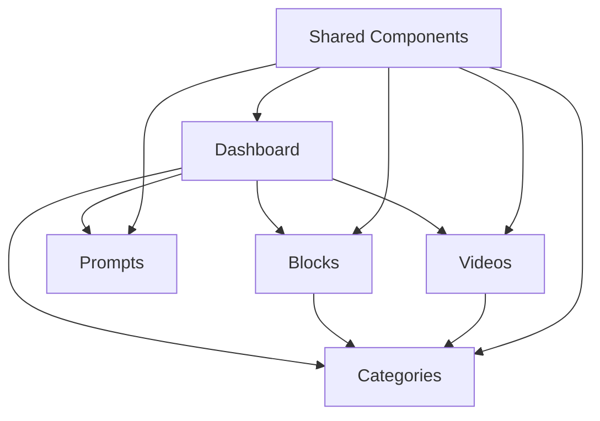

# Arquitetura Feature-Based

## Visão Geral

Este projeto utiliza uma arquitetura baseada em features/domínios para organizar o código de forma modular e escalável.

## Estrutura de Pastas

```
src/
├── features/              # Features organizadas por domínio
│   ├── blocks/           # Feature de blocos
│   │   ├── components/   # Componentes específicos de blocos
│   │   ├── hooks/        # Hooks específicos de blocos
│   │   ├── pages/        # Páginas específicas de blocos
│   │   ├── types/        # Tipos específicos de blocos
│   │   ├── utils/        # Utilitários específicos de blocos
│   │   └── index.ts      # Barrel export
│   ├── categories/       # Feature de categorias
│   ├── prompts/          # Feature de prompts
│   ├── videos/           # Feature de vídeos
│   └── dashboard/        # Feature de dashboard
├── components/           # Componentes compartilhados
├── hooks/                # Hooks compartilhados
├── core/                 # Funcionalidades centrais (Logger, ErrorHandler)
├── integrations/         # Integrações externas (Supabase)
└── tests/                # Testes organizados por tipo
```

## Princípios

### 1. Separação por Domínio
Cada feature é organizada como um módulo independente com sua própria responsabilidade.

### 2. Barrel Exports
Cada feature expõe sua API através de um arquivo `index.ts` que serve como ponto de entrada único.

### 3. Boundaries Claros
Features não devem importar diretamente umas das outras. Toda comunicação deve passar pelo barrel export.

### 4. Single Responsibility
Cada arquivo, componente e hook tem uma responsabilidade bem definida.

## Dependências Entre Features



## Padrões de Importação

### ✅ Correto
```typescript
// Importação através do barrel export
import { useOptimizedBlocks, BlocksPage } from '@/features/blocks'

// Importação de componentes compartilhados
import { Button } from '@/components/ui/button'
```

### ❌ Incorreto
```typescript
// Importação direta ignorando o barrel export
import { useOptimizedBlocks } from '@/features/blocks/hooks/useOptimizedBlocks'

// Importação entre features sem usar barrel exports
import { useOptimizedCategories } from '@/features/categories/hooks/useOptimizedCategories'
```

## Testing Strategy

### Unit Tests
- Hooks isolados com mocks de dependências
- Funções utilitárias puras
- Validações e formatações

### Integration Tests
- Componentes com suas dependências
- Fluxos entre componentes relacionados

### E2E Tests (Futuro)
- Fluxos críticos completos
- Jornadas do usuário

## Quality Assurance

### ESLint Rules
- Import ordering obrigatório
- Detecção de importações circulares
- Detecção de importações de parent folders

### Prettier
- Formatação consistente
- Configuração específica para o projeto

### TypeScript
- Strict mode habilitado
- Tipos explícitos obrigatórios
- No implicit any

## Developer Experience

### Scripts Disponíveis
- `npm run test` - Executa todos os testes
- `npm run test:coverage` - Gera relatório de cobertura
- `npm run lint` - Verifica padrões de código
- `npm run format` - Formata código automaticamente
- `npm run type-check` - Verifica tipos TypeScript

### Debug Tools
- `npm run debug:hooks` - Debug específico para hooks
- `npm run debug:api` - Debug específico para APIs

## Migração

A migração para esta arquitetura foi feita preservando toda a funcionalidade existente:

1. **Movimentação de arquivos** - Hooks e pages foram movidos para suas respectivas features
2. **Criação de barrel exports** - Cada feature expõe sua API através de index.ts
3. **Atualização de importações** - Imports foram atualizados para usar os barrel exports
4. **Configuração de testes** - Vitest configurado com coverage
5. **Configuração de linting** - ESLint restritivo para manter qualidade

## Próximos Passos

1. Implementar testes E2E com Playwright
2. Configurar pre-commit hooks com Husky
3. Adicionar mais debug tools
4. Implementar bundle analysis
5. Configurar CI/CD com quality gates
